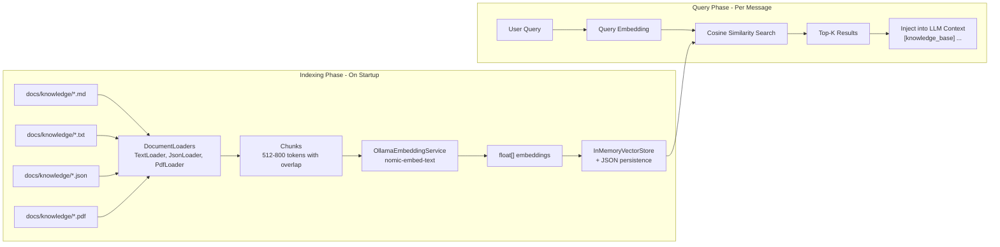
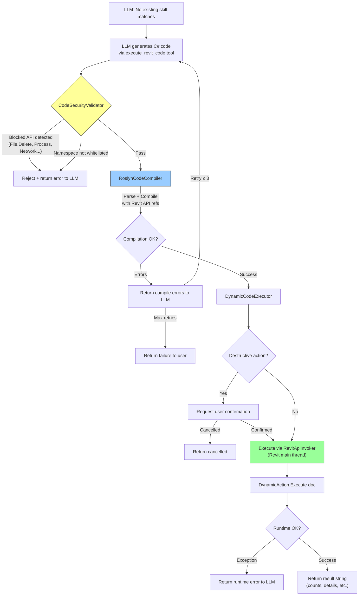
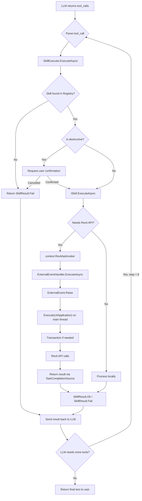
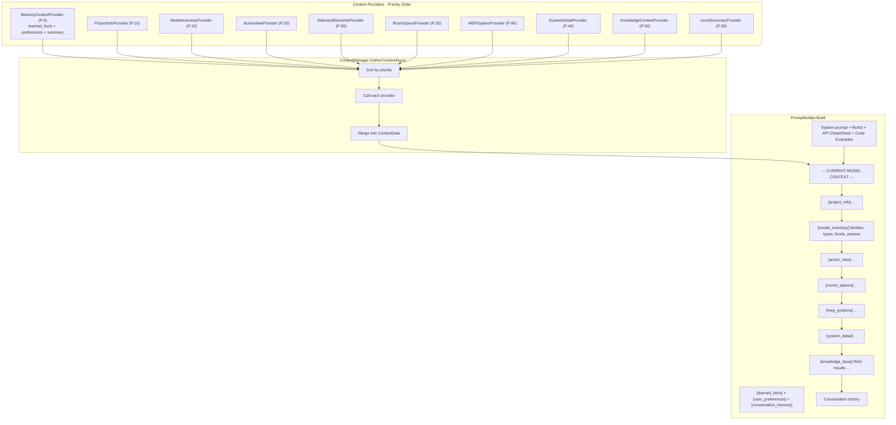
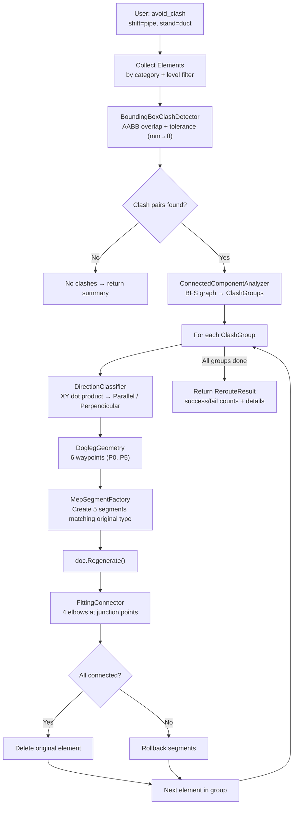
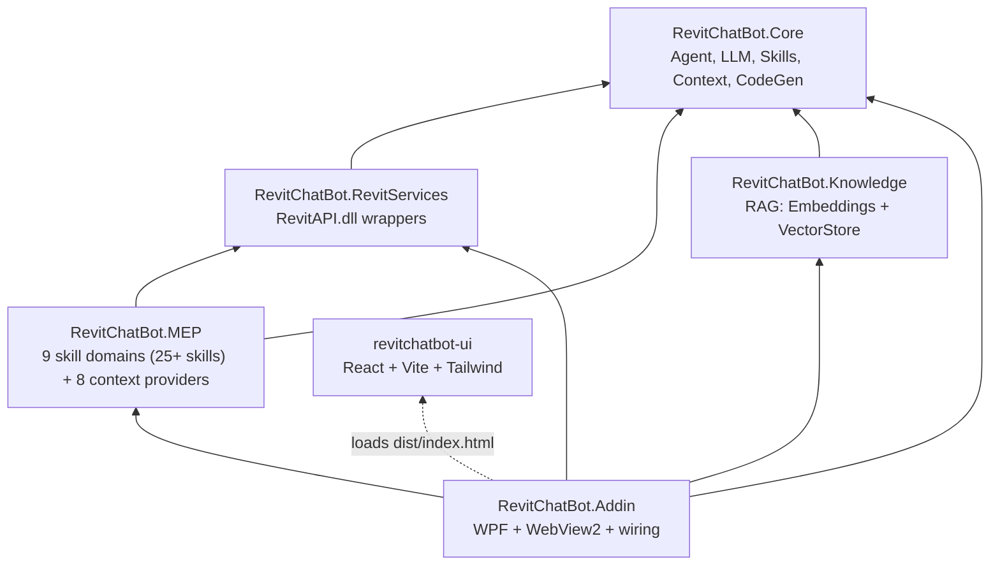
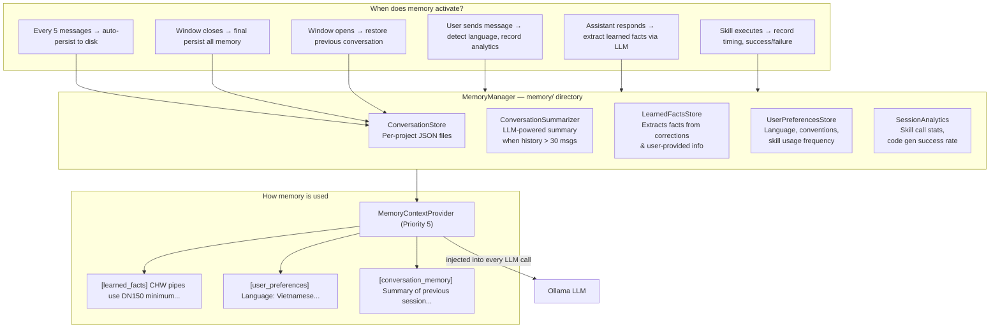

# Revit MEP ChatBot

An AI-powered chatbot embedded in Autodesk Revit 2025 for MEP (Mechanical, Electrical, Plumbing) engineering tasks. Uses **Ollama** (`qwen2.5:7b`) for local LLM inference, **RAG** for standards lookup, a **ReAct agent** for multi-step reasoning, **Roslyn dynamic code generation** for unlimited Revit API operations, **cross-session memory** with conversation persistence and self-learning, and a **React** UI rendered via WebView2.

## Architecture Overview

```mermaid
graph TB
    subgraph Revit2025 [Revit 2025 Process]
        subgraph AddinLayer [RevitChatBot.Addin]
            RibbonBtn[Ribbon Button]
            WPF[WPF Window]
            WV2[WebView2 Control]
            Bridge[WebViewBridge]
            EEH[ExternalEventHandler]
        end
    end

    subgraph CoreLayer [RevitChatBot.Core - Reusable]
        AO[AgentOrchestrator<br/>ReAct Pattern]
        CSV2[ChatSessionV2]
        PB[PromptBuilder]
        OLS[OllamaService]
        SR[SkillRegistry]
        SE[SkillExecutor]
        CM[ContextManager]
        subgraph CodeGenSub [CodeGen - Roslyn Runtime]
            RCC[RoslynCodeCompiler]
            DCE[DynamicCodeExecutor]
            DCS[DynamicCodeSkill]
            CSV[CodeSecurityValidator]
            ACS["RevitApiCheatSheet<br/>+ CodeExamplesLibrary"]
        end
        subgraph MemorySub [Memory - Cross-Session Learning]
            MM[MemoryManager]
            CSTORE[ConversationStore]
            CSUM[ConversationSummarizer]
            LFS[LearnedFactsStore]
            UPS[UserPreferencesStore]
            SANA[SessionAnalytics]
            MCTX[MemoryContextProvider]
        end
    end

    subgraph KnowledgeLayer [RevitChatBot.Knowledge - RAG]
        ES[OllamaEmbeddingService]
        VS[InMemoryVectorStore]
        KM[KnowledgeManager]
        DL["DocumentLoaders<br/>(Text, JSON)"]
        KCP[KnowledgeContextProvider]
        KSS[KnowledgeSearchSkill]
    end

    subgraph MEPLayer [RevitChatBot.MEP - Skills & Context]
        direction LR
        subgraph SkillSubs [Skills by Domain]
            SQ["Query: Elements, Overview,<br/>SystemAnalysis, Connectivity,<br/>Space, MapRoomToMep"]
            SCk["Check: Velocity, Slope, Connection,<br/>Insulation, Clearance, DirectionalClearance,<br/>FireDamper, Audit, Compliance"]
            SH[HVAC: Load, DuctSizing]
            SPl[Plumbing: PipeSizing, Drainage]
            SEl[Electrical: LoadAnalysis]
            SC["Coordination: Clash, AdvClash,<br/>AvoidClash (Reroute Engine)"]
            SM["Modify: Create, ModifyParam,<br/>BatchModify, SplitDuctPipe"]
            SR2[Report: ExportReport]
            SCa[Calculation: MEPCalc]
        end
        subgraph CtxSubs [Context Providers]
            CP1[ProjectInfo]
            CP2[ActiveView]
            CP3[SelectedElements]
            CP4[MEPSystem]
            CP5[RoomSpace]
            CP6[SystemDetail]
            CP7[LevelSummary]
            CP8[ModelInventory]
        end
    end

    subgraph ServicesLayer [RevitChatBot.RevitServices]
        RES[RevitElementService]
        RDS[RevitDocumentService]
        RMS[RevitMEPService]
    end

    subgraph ReactUI [React UI - Vite + TypeScript + Tailwind]
        CW[ChatWindow]
        MB[MessageBubble]
        IB[InputBar]
        SP[SkillPanel]
        BridgeTS[bridge.ts]
    end

    subgraph OllamaServer [Ollama - localhost:11434]
        LLM["qwen2.5:7b<br/>/api/chat"]
        EMB["nomic-embed-text<br/>/api/embed"]
    end

    subgraph KnowledgeBase [Knowledge Base - docs/knowledge/]
        KB0[bim-standards/]
        KB1[mep-standards/]
        KB2[revit-api/]
        KB3[project-specs/]
    end

    RibbonBtn -->|click| WPF
    WPF --> WV2
    WV2 <-->|postMessage JSON| BridgeTS
    BridgeTS --> CW
    CW --> MB & IB & SP

    Bridge <-->|WebMessageReceived| WV2
    Bridge --> CSV2
    CSV2 --> AO
    AO --> PB
    AO --> OLS
    OLS <-->|HTTP REST| LLM
    AO --> SE
    SE --> SR
    SR --> SQ & SCk & SH & SPl & SEl & SC & SM & SR2 & SCa & KSS & DCS
    AO --> CM
    CM --> CP1 & CP2 & CP3 & CP4 & CP5 & CP6 & CP7 & CP8 & KCP

    KCP --> KM
    KSS --> KM
    KM --> ES & VS & DL
    ES <-->|HTTP REST| EMB
    DL -->|load| KB0 & KB1 & KB2 & KB3

    DCS --> CSV
    CSV -->|validate| DCE
    DCE --> RCC
    RCC -->|compile C#| DCE
    SQ & SCk & SH & SPl & SEl & SC & SM & SR2 & SCa & DCE -->|RevitApiInvoker| EEH
    EEH -->|"Main Thread"| RES & RDS & RMS
    ACS -->|injected into system prompt| AO
    AO --> MM
    MM --> CSTORE & CSUM & LFS & UPS & SANA
    MCTX -->|"learned_facts + preferences + summary"| CM
    MM --> MCTX
    CP1 & CP2 & CP3 & CP4 & CP5 & CP6 & CP7 & CP8 --> RES & RDS & RMS
```



## ReAct Agent Flow

```mermaid
sequenceDiagram
    participant U as User
    participant R as React UI
    participant B as WebViewBridge
    participant A as AgentOrchestrator
    participant CM as ContextManager
    participant KCP as KnowledgeContextProvider
    participant OL as OllamaService
    participant SE as SkillExecutor
    participant EH as ExternalEventHandler

    U->>R: Type message
    R->>B: postMessage(user_message)
    B->>B: KnowledgeContextProvider.SetQuery(text)
    B->>A: ExecuteAsync(text)

    A->>CM: GatherContextAsync()
    Note over CM: 8 MEP providers + RAG provider + ModelInventory
    CM->>KCP: GatherAsync()
    KCP->>KCP: SearchAsync(query) via KnowledgeManager
    CM-->>A: ContextData (project + MEP + knowledge)

    loop ReAct Loop (max 8 steps)
        A->>OL: ChatAsync(messages, tools)
        OL-->>A: Response

        alt Has tool_calls
            Note over A: THOUGHT: LLM reasoning
            A->>A: OnStepExecuted(Thought)

            loop For each tool_call
                alt Destructive action
                    A->>R: ConfirmationRequired
                    R-->>A: User confirms/cancels
                end

                Note over A: ACTION: Execute skill
                A->>SE: ExecuteAsync(skill, params)
                SE->>EH: RevitApiInvoker
                EH-->>SE: result
                SE-->>A: SkillResult

                Note over A: OBSERVATION: Review result
                A->>A: OnStepExecuted(Observation)
            end
        else No tool_calls
            Note over A: ANSWER: Final response
            break
        end
    end

    A-->>B: AgentPlan.FinalAnswer
    B-->>R: postMessage(assistant_message)
    R-->>U: Display response
```

## RAG Knowledge Pipeline



## Dynamic Code Generation Flow (Revit Code Interpreter)



## Skill Execution Flow



## Context Injection Flow



## Clash Avoidance Rerouting Pipeline



## Project Dependency Graph



## Solution Structure

```
RevitChatBot.slnx
├── src/
│   ├── RevitChatBot.Core/               # Reusable - no Revit dependency
│   │   ├── Agent/                        # AgentOrchestrator (ReAct), ChatSessionV2, AgentStep
│   │   ├── CodeGen/                      # RoslynCodeCompiler, DynamicCodeExecutor, DynamicCodeSkill, CodeSecurityValidator, RevitApiCheatSheet, CodeExamplesLibrary
│   │   ├── Memory/                       # MemoryManager, ConversationStore, ConversationSummarizer, LearnedFactsStore, UserPreferencesStore, SessionAnalytics, MemoryContextProvider
│   │   ├── LLM/                          # OllamaService, ChatSession, PromptBuilder
│   │   ├── Skills/                       # ISkill, SkillAttribute, SkillRegistry, SkillExecutor
│   │   ├── Context/                      # IContextProvider, ContextManager, ContextData
│   │   └── Models/                       # ChatMessage, BridgeMessage, ToolCall
│   │
│   ├── RevitChatBot.RevitServices/       # Revit API wrappers
│   │   ├── RevitElementService.cs
│   │   ├── RevitDocumentService.cs
│   │   └── RevitMEPService.cs
│   │
│   ├── RevitChatBot.Knowledge/           # RAG module
│   │   ├── Embeddings/                   # IEmbeddingService, OllamaEmbeddingService
│   │   ├── VectorStore/                  # IVectorStore, InMemoryVectorStore
│   │   ├── Documents/                    # IDocumentLoader, TextLoader, JsonLoader, PdfLoader
│   │   └── Search/                       # KnowledgeManager, KnowledgeContextProvider, KnowledgeSearchSkill
│   │
│   ├── RevitChatBot.MEP/                 # MEP domain skills & context
│   │   ├── Skills/
│   │   │   ├── Query/                    # QueryElements, SystemOverview, SystemAnalysis, ConnectivityAnalysis, SpaceAnalysis
│   │   │   ├── Check/                    # CheckVelocity, CheckSlope, CheckConnection, CheckInsulation, CheckClearance, CheckFireDamper, ModelAudit, ComplianceCheck
│   │   │   ├── HVAC/                     # HvacLoadCalculation, DuctSizing
│   │   │   ├── Plumbing/                 # PipeSizing, DrainageCalculation
│   │   │   ├── Electrical/               # ElectricalLoad
│   │   │   ├── Coordination/             # ClashDetection, AdvancedClashDetection, AvoidClash
│   │   │   │   └── Routing/             # MepRoutingEngine, DoglegGeometry, BoundingBoxClashDetector,
│   │   │   │                            # ConnectedComponentAnalyzer, DirectionClassifier,
│   │   │   │                            # MepSegmentFactory, FittingConnector
│   │   │   ├── Calculation/              # MEPCalculation
│   │   │   ├── Modify/                   # CreateElement, ModifyParameter, BatchModify, SplitDuctPipe
│   │   │   └── Report/                   # ExportReport
│   │   └── Context/                      # 8 providers (ProjectInfo, ActiveView, Selected, MEPSystem, RoomSpace, SystemDetail, LevelSummary, ModelInventory)
│   │
│   └── RevitChatBot.Addin/              # Revit 2025 Add-in entry point
│       ├── App.cs                        # IExternalApplication + Ribbon
│       ├── Commands/                     # ShowChatBotCommand
│       ├── Views/                        # WPF Window + WebView2
│       ├── Bridge/                       # WebViewBridge (React <-> C# + Knowledge + Agent)
│       └── Handlers/                     # ExternalEventHandler
│
├── ui/revitchatbot-ui/                   # React frontend
│   └── src/
│       ├── components/                   # ChatWindow, MessageBubble, InputBar, SkillPanel, SettingsPanel
│       ├── hooks/                        # useRevitBridge
│       ├── services/                     # bridge.ts
│       └── types/                        # TypeScript interfaces
│
├── docs/
│   ├── references/                       # Reference documentation links
│   └── knowledge/                        # RAG knowledge base (standards, specs)
│       ├── bim-standards/                # ISO 19650, 29481, 12006, 7817, 23386, DIN 276
│       │   ├── ISO-19650/                # 5 parts: concepts, delivery, operations, exchange, security
│       │   ├── ISO-29481/                # 3 parts: IDM methodology, interaction, data schema
│       │   ├── ISO-12006/                # Classification framework & object-oriented info
│       │   ├── ISO-other/                # ISO 7817, 12911, 23386, 23387 + unidentified
│       │   ├── DIN/                      # DIN 276 Building costs
│       │   └── bim-standards-knowledge.md # Comprehensive RAG summary
│       ├── mep-standards/                # ASHRAE, SMACNA, TCVN, DIN EN standards (64 PDFs)
│       │   ├── mep-routing-knowledge.md  # Clash detection, dogleg routing, MEP creation
│       │   └── mep-spatial-clearance-knowledge.md # Ray casting, room mapping, split/union
│       ├── revit-api/                    # Revit API notes
│       └── project-specs/                # Project-specific specs
│
├── Directory.Build.props                 # Revit API path config
└── .gitignore
```

## MEP Skills

| Domain | Skill | Description |
|---|---|---|
| **Query** | `query_elements` | Query ducts, pipes, equipment by category/system |
| **Query** | `mep_system_overview` | Comprehensive overview of all MEP systems |
| **Query** | `system_analysis` | Analyze MEP systems: group by classification, count, total length |
| **Query** | `connectivity_analysis` | BFS traversal of MEP network from a starting element |
| **Query** | `space_analysis` | Analyze MEP spaces: area, volume, design vs actual airflow |
| **Check** | `check_duct_velocity` | Check duct velocity violations (max m/s threshold) |
| **Check** | `check_pipe_slope` | Check pipe slope violations (min % threshold) |
| **Check** | `check_disconnected_mep` | Find disconnected MEP elements across all categories |
| **Check** | `check_insulation` | Check missing insulation coverage (ducts/pipes) |
| **Check** | `check_clearance` | Check elevation/clearance conflicts (min height m) |
| **Check** | `check_fire_dampers` | Check fire damper connection status |
| **Check** | `check_parameter_completeness` | Check parameter fill rate on elements |
| **Check** | `model_audit` | Model audit: warnings, element counts, top issues |
| **HVAC** | `hvac_load_calculation` | Cooling/heating load per space |
| **HVAC** | `duct_sizing_analysis` | Velocity-based duct sizing check |
| **Plumbing** | `pipe_sizing_analysis` | Pipe velocity and diameter analysis |
| **Plumbing** | `drainage_analysis` | Sanitary/storm slope and sizing |
| **Electrical** | `electrical_load_analysis` | Panel load distribution and circuits |
| **Coordination** | `clash_detection` | Basic bounding box clash detection |
| **Coordination** | `advanced_clash_detection` | Severity-classified, level-filtered clashes |
| **Coordination** | `avoid_clash` | MEP rerouting engine: detect clashes → group (BFS) → classify direction → dogleg reroute (5 segments + 4 elbows). Supports Pipe/Duct/CableTray/Conduit. Analyze or execute mode. |
| **Check** | `check_directional_clearance` | Ray casting (ReferenceIntersector) in 6 directions against walls/floors/ceilings/columns/beams. Linked model support. Multi-condition threshold checking. |
| **Query** | `map_room_to_mep` | Map Room/Space parameters to MEP elements via IsPointInRoom/Space API. Above-space detection. Report or execute mode. |
| **Modify** | `split_duct_pipe` | Split duct/pipe into equal segments at specified distance. Auto-creates union fittings. Sequential numbering. Bi-directional support. |
| **Calculation** | `mep_calculation` | Duct/pipe summary, airflow analysis |
| **Modify** | `modify_parameter` | Change element parameter values |
| **Modify** | `create_element` | Create new ducts or pipes |
| **Modify** | `batch_modify` | Batch modify parameters on multiple elements |
| **Report** | `export_report` | Generate project overview, schedules, reports |
| **Knowledge** | `search_knowledge_base` | RAG search through standards/specs |
| **CodeGen** | `execute_revit_code` | Generate & execute any C# via Roslyn (unlimited operations) |

## Prerequisites

- **Revit 2025** (with .NET 8 runtime)
- **Ollama** running locally with `qwen2.5:7b` + `nomic-embed-text` models
- **Node.js 18+** (for building the React UI)
- **.NET 8 SDK** or **Visual Studio 2022**

## Setup

### 1. Configure Revit API Path

Edit `Directory.Build.props` in the root directory:

```xml
<RevitApiPath>C:\Program Files\Autodesk\Revit 2025</RevitApiPath>
```

### 2. Build the React UI

```bash
cd ui/revitchatbot-ui
npm install
npm run build
```

### 3. Build the Solution

```bash
dotnet build RevitChatBot.slnx
```

### 4. Pull Ollama Models

```bash
ollama serve
ollama pull qwen2.5:7b
ollama pull nomic-embed-text
```

### 5. Add Knowledge Base (Optional)

Place standards documents (`.txt`, `.md`, `.json`, `.pdf`) in `docs/knowledge/`:

- `bim-standards/` - BIM Standards (ISO 19650, ISO 29481, ISO 12006, ISO 7817, ISO 23386/23387, DIN 276)
  - `ISO-19650/` - Information management (Parts 1-5): CDE, EIR, BEP, delivery & operations
  - `ISO-29481/` - Information Delivery Manual (IDM): methodology, interaction framework, data schema
  - `ISO-12006/` - Construction classification framework & object-oriented information
  - `ISO-other/` - Level of info need (7817), BIM implementation (12911), data templates (23386/23387)
  - `DIN/` - DIN 276 Building costs (KG 400 = MEP systems)
  - `bim-standards-knowledge.md` - Comprehensive summary for RAG indexing
- `mep-standards/` - ASHRAE, SMACNA, TCVN, DIN EN standards (64 PDFs)
- `revit-api/` - Revit API reference notes, 2025 API changes
- `project-specs/` - Project-specific specifications

The chatbot will auto-index all files (including PDFs via PdfDocumentLoader) and use them via RAG.

### 6. Install the Add-in

Copy from the build output to Revit's add-in folder:

```
%APPDATA%\Autodesk\Revit\Addins\2025\
├── RevitChatBot.addin
├── RevitChatBot.Addin.dll
├── RevitChatBot.Core.dll
├── RevitChatBot.MEP.dll
├── RevitChatBot.Knowledge.dll
├── RevitChatBot.RevitServices.dll
├── Microsoft.CodeAnalysis.*.dll     # Roslyn compiler
├── Microsoft.Web.WebView2.*.dll
├── UglyToad.PdfPig.*.dll            # PDF loader
├── knowledge/                    # Copy from docs/knowledge/
│   └── (standards files)
├── knowledge_index.json          # Auto-generated vector index
└── ui/
    └── index.html (+ assets/)
```

### 7. Launch Revit

Open Revit 2025. Find the **MEP ChatBot** button in the ribbon panel.

## Adding New Skills

1. Create a class in the appropriate `RevitChatBot.MEP/Skills/<Domain>/` folder
2. Implement `ISkill` and add `[Skill]` + `[SkillParameter]` attributes
3. Skills are auto-discovered via reflection at startup

```csharp
[Skill("my_skill", "Description for the LLM")]
[SkillParameter("param1", "string", "What this param does")]
public class MySkill : ISkill
{
    public async Task<SkillResult> ExecuteAsync(
        SkillContext context,
        Dictionary<string, object?> parameters,
        CancellationToken ct = default)
    {
        var result = await context.RevitApiInvoker!(doc => { ... });
        return SkillResult.Ok("Done", result);
    }
}
```

## Adding Knowledge Documents

Place files in `docs/knowledge/` with one of these formats:

**Text/Markdown** - Split into chunks by paragraph:
```
docs/knowledge/mep-standards/ashrae-duct-sizing.md
```

**PDF** - Extracted via PdfPig, auto-categorized by standard number:
```
docs/knowledge/mep-standards/DIN EN 16798-1 - Language English 3334892.pdf
```

**JSON** - Structured entries:
```json
[
  { "content": "ASHRAE recommends max duct velocity of 2000 FPM for main ducts...", "category": "HVAC" },
  { "content": "Minimum pipe slope for sanitary drainage: 1/8 inch per foot...", "category": "Plumbing" }
]
```

## Memory System (Cross-Session Learning)

The chatbot includes a comprehensive memory system that persists across sessions:



### Memory Files Structure

```
memory/
├── conversations/
│   ├── conv_my_project_name.json      # Per-project conversation snapshot
│   └── conv_another_project.json
├── learned_facts.json                  # Facts extracted from user corrections
├── preferences.json                    # User preferences (language, conventions)
└── analytics.json                      # Skill usage stats, code gen metrics
```

### Self-Learning Flow

1. **User corrects the bot**: "Không phải vậy, ống CHW trong dự án này dùng DN150 tối thiểu"
2. **LearnedFactsStore** detects correction markers ("không phải", "thực ra", etc.)
3. **LLM extracts facts**: `["CHW pipes in this project use DN150 minimum"]`
4. **Fact is persisted** to `learned_facts.json`
5. **Next session**: fact is injected into `[learned_facts]` context, LLM remembers

## References

- [Revit API 2025.3 Docs](https://www.revitapidocs.com/2025.3/)
- [Ollama GitHub + API Docs](https://github.com/ollama/ollama)
- [WebView2 Documentation](https://learn.microsoft.com/en-us/microsoft-edge/webview2/)
