# Revit MEP ChatBot

An AI-powered chatbot embedded in Autodesk Revit 2025 for MEP (Mechanical, Electrical, Plumbing) engineering tasks. Uses **Ollama** (`qwen2.5:7b`) for local LLM inference, **RAG** for standards lookup, a **ReAct agent** for multi-step reasoning, **Roslyn dynamic code generation** for unlimited Revit API operations, **self-evolving skills** (codegen results auto-saved and promotable to reusable skills), **cross-session memory** with conversation persistence, **smart query understanding** (bilingual intent/entity extraction, adaptive prompting, semantic skill routing, few-shot examples, clarification flow), **advanced LLM intelligence** (conversation rewriting, context window optimization, smart history pruning, multi-intent decomposition, adaptive few-shot learning, dynamic glossary, skill success feedback, prompt caching, response quality validation, streaming intent detection), **autonomous self-training** (plan replay, self-evaluation, composite skill discovery, knowledge synthesis, skill gap analysis, workflow discovery), and a **React** UI rendered via WebView2.

## Architecture Overview

```mermaid
graph TB
    subgraph Revit2025 [Revit 2025 Process]
        subgraph AddinLayer [RevitChatBot.Addin]
            RibbonBtn[Ribbon Button]
            WPF[WPF Window]
            WV2[WebView2 Control]
            Bridge[WebViewBridge]
            EEH[ExternalEventHandler]
        end
    end

    subgraph CoreLayer [RevitChatBot.Core - Reusable]
        AO[AgentOrchestrator<br/>ReAct Pattern]
        CSV2[ChatSessionV2]
        PB[PromptBuilder]
        OLS[OllamaService]
        SR[SkillRegistry]
        SE[SkillExecutor]
        CM[ContextManager]
        subgraph QueryUnderstanding [Query Understanding - Smart NLU]
            QP[QueryPreprocessor<br/>intent+entity extraction]
            APB[AdaptivePromptBuilder<br/>dynamic system prompt]
            SSR[SemanticSkillRouter<br/>embedding-based routing]
            MG[MepGlossary<br/>VI↔EN terminology]
            CF[ClarificationFlow<br/>ambiguity handling]
            FSI[FewShotIntentLibrary<br/>curated examples]
        end
        subgraph LLMIntelligence [LLM Intelligence - Advanced Modules]
            CQR[ConversationQueryRewriter<br/>context-aware rewriting]
            CWO[ContextWindowOptimizer<br/>token budget management]
            SHP[SmartHistoryPruner<br/>intelligent trimming]
            MID[MultiIntentDecomposer<br/>compound query splitting]
            AFSL[AdaptiveFewShotLearning<br/>cross-session examples]
            DG[DynamicGlossary<br/>per-project terms]
            SSF[SkillSuccessFeedback<br/>analytics-based routing]
            PC[PromptCache<br/>pre-compiled templates]
            RQV[ResponseQualityValidator<br/>retry on low quality]
            SID[StreamingIntentDetector<br/>real-time prediction]
        end
        subgraph CodeGenSub [CodeGen - Roslyn Runtime + Self-Evolving]
            RCC[RoslynCodeCompiler]
            DCE[DynamicCodeExecutor]
            DCS[DynamicCodeSkill]
            CSV[CodeSecurityValidator]
            ACS["RevitApiCheatSheet<br/>+ CodeExamplesLibrary"]
            CGL["CodeGenLibrary<br/>(reuse cache)"]
            DSR["DynamicSkillRegistry<br/>(runtime skills)"]
            CPL["CodePatternLearning<br/>(error/API patterns)"]
        end
        subgraph MemorySub [Memory - Cross-Session Learning]
            MM[MemoryManager]
            CSTORE[ConversationStore]
            CSUM[ConversationSummarizer]
            LFS[LearnedFactsStore]
            UPS[UserPreferencesStore]
            SANA[SessionAnalytics]
            MCTX[MemoryContextProvider]
        end
        subgraph SelfTrainSub [Self-Training - Autonomous Improvement]
            PRS[PlanReplayStore<br/>experience replay]
            IR[InteractionRecorder<br/>interaction logging]
            SEV[SelfEvaluator<br/>LLM self-critique]
            IS[ImprovementStore<br/>lessons learned]
            CSE[CompositeSkillEngine<br/>auto-compose skills]
            SGA[SkillGapAnalyzer<br/>detect missing skills]
            SDA[SkillDiscoveryAgent<br/>workflow ideation]
            STS[SelfTrainingScheduler<br/>background orchestrator]
            SLPM[SelfLearningPersistenceManager<br/>coordinated save/load]
        end
    end

    subgraph KnowledgeSynthSub [Knowledge Synthesis]
        KS[KnowledgeSynthesizer<br/>auto-generate articles from interactions]
    end

    subgraph KnowledgeLayer [RevitChatBot.Knowledge - RAG]
        ES[OllamaEmbeddingService]
        VS[InMemoryVectorStore]
        KM[KnowledgeManager]
        DL["DocumentLoaders<br/>(Text, JSON)"]
        KCP[KnowledgeContextProvider]
        KSS[KnowledgeSearchSkill]
    end

    subgraph MEPLayer [RevitChatBot.MEP - Skills & Context]
        direction LR
        subgraph SkillSubs [Skills by Domain]
            SQ["Query: Elements, Overview,<br/>SystemAnalysis, Connectivity,<br/>Space, MapRoomToMep,<br/>TraverseMepSystem, RoutingPrefs"]
            SCk["Check: Velocity, Slope, Connection,<br/>Insulation, Clearance, DirectionalClearance,<br/>FireDamper, Audit, Compliance"]
            SH[HVAC: Load, DuctSizing]
            SPl[Plumbing: PipeSizing, Drainage]
            SEl[Electrical: LoadAnalysis]
            SC["Coordination: Clash, AdvClash,<br/>AvoidClash (Reroute Engine)"]
            SM["Modify: Create, ModifyParam,<br/>BatchModify, SplitDuctPipe<br/>(Duct/Pipe/Conduit/CableTray)"]
            SR2[Report: ExportReport]
            SCa[Calculation: MEPCalc]
        end
        subgraph CtxSubs [Context Providers]
            CP1[ProjectInfo]
            CP2[ActiveView]
            CP3[SelectedElements]
            CP4[MEPSystem]
            CP5[RoomSpace]
            CP6[SystemDetail]
            CP7[LevelSummary]
            CP8[ModelInventory]
        end
    end

    subgraph ServicesLayer [RevitChatBot.RevitServices]
        RES[RevitElementService]
        RDS[RevitDocumentService]
        RMS[RevitMEPService]
    end

    subgraph ReactUI [React UI - Vite + TypeScript + Tailwind]
        CW[ChatWindow]
        MB[MessageBubble]
        IB[InputBar]
        SP[SkillPanel]
        BridgeTS[bridge.ts]
    end

    subgraph OllamaServer [Ollama - localhost:11434]
        LLM["qwen2.5:7b<br/>/api/chat + /api/generate"]
        EMB["nomic-embed-text<br/>/api/embed"]
    end

    subgraph KnowledgeBase [Knowledge Base - docs/knowledge/]
        KB0[bim-standards/]
        KB1[mep-standards/]
        KB2[revit-api/]
        KB3[project-specs/]
    end

    RibbonBtn -->|click| WPF
    WPF --> WV2
    WV2 <-->|postMessage JSON| BridgeTS
    BridgeTS --> CW
    CW --> MB & IB & SP

    Bridge <-->|WebMessageReceived| WV2
    Bridge --> CSV2
    CSV2 --> AO
    AO --> PB
    AO --> OLS
    OLS <-->|HTTP REST| LLM
    AO --> SE
    SE --> SR
    SR --> SQ & SCk & SH & SPl & SEl & SC & SM & SR2 & SCa & KSS & DCS
    AO --> CM
    CM --> CP1 & CP2 & CP3 & CP4 & CP5 & CP6 & CP7 & CP8 & KCP

    KCP --> KM
    KSS --> KM
    KM --> ES & VS & DL
    ES <-->|HTTP REST| EMB
    DL -->|load| KB0 & KB1 & KB2 & KB3

    DCS --> CSV
    CSV -->|validate| DCE
    DCE --> RCC
    RCC -->|compile C#| DCE
    SQ & SCk & SH & SPl & SEl & SC & SM & SR2 & SCa & DCE -->|RevitApiInvoker| EEH
    EEH -->|"Main Thread"| RES & RDS & RMS
    ACS -->|injected into system prompt| AO
    AO --> MM
    MM --> CSTORE & CSUM & LFS & UPS & SANA
    MCTX -->|"learned_facts + preferences + summary"| CM
    MM --> MCTX
    CP1 & CP2 & CP3 & CP4 & CP5 & CP6 & CP7 & CP8 --> RES & RDS & RMS
```

## ReAct Agent Flow

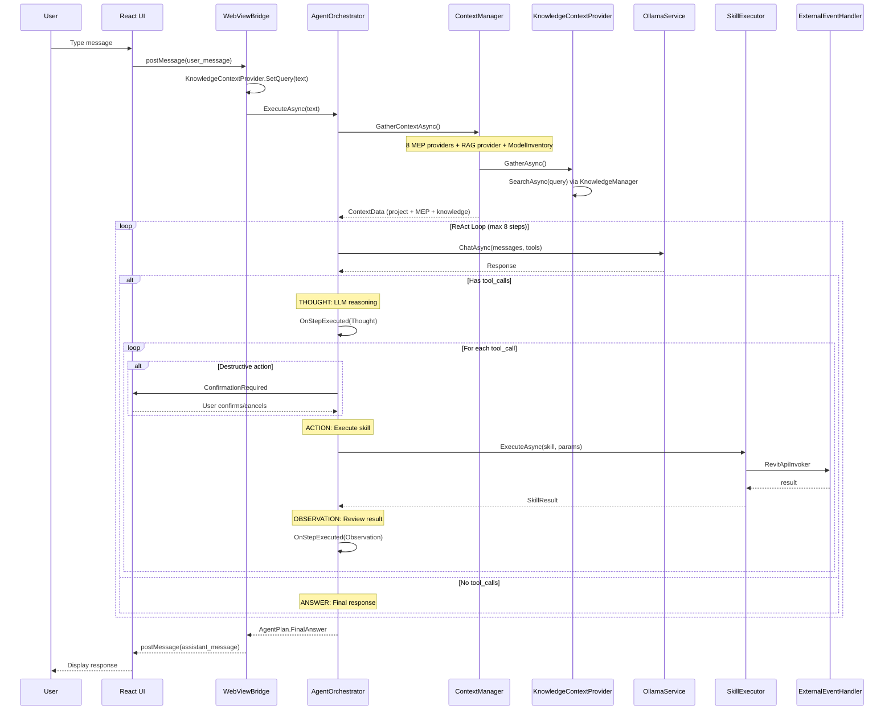

## RAG Knowledge Pipeline

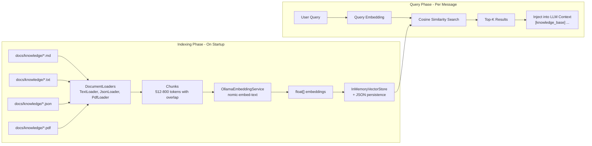

## Dynamic Code Generation Flow (Revit Code Interpreter)

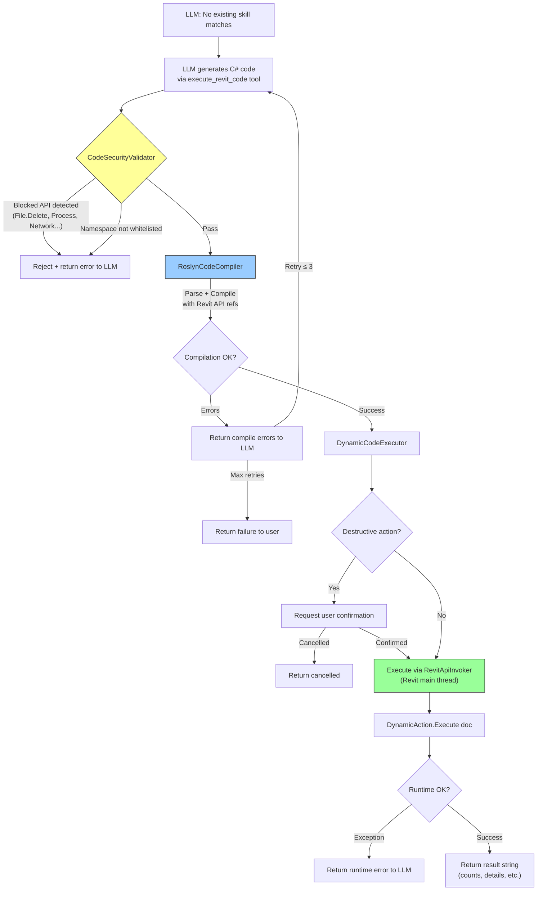

## Skill Execution Flow

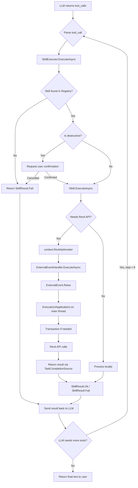

## Context Injection Flow

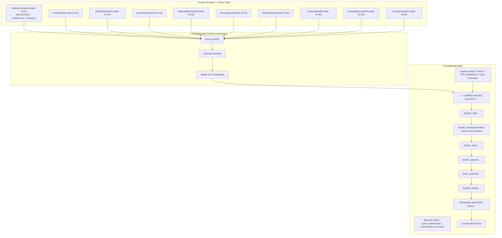

## Clash Avoidance Rerouting Pipeline

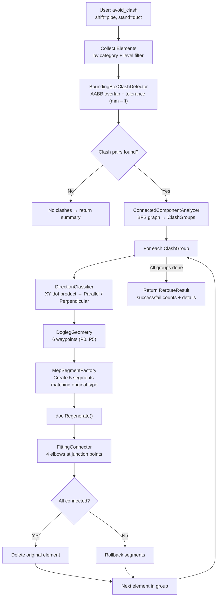

## Project Dependency Graph

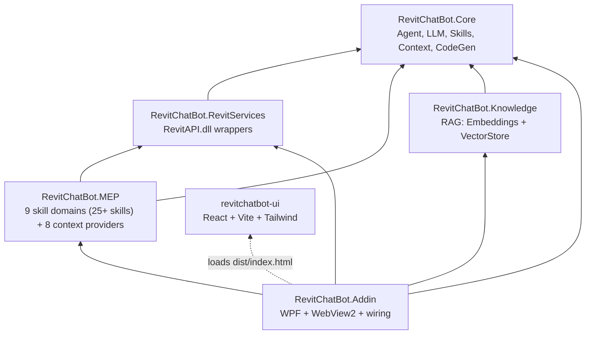

## Solution Structure

```
RevitChatBot.slnx
├── src/
│   ├── RevitChatBot.Core/               # Reusable - no Revit dependency
│   │   ├── Agent/                        # AgentOrchestrator (ReAct), ChatSessionV2, AgentStep, PlanReplayStore, InteractionRecorder, SelfLearningPersistenceManager, SelfTrainingScheduler, SkillDiscoveryAgent
│   │   ├── CodeGen/                      # RoslynCodeCompiler, DynamicCodeExecutor, DynamicCodeSkill, CodeSecurityValidator, RevitApiCheatSheet, CodeExamplesLibrary, CodeGenLibrary, DynamicSkillRegistry, CodePatternLearning, CompositeSkillEngine
│   │   ├── Memory/                       # MemoryManager, ConversationStore, ConversationSummarizer, LearnedFactsStore, UserPreferencesStore, SessionAnalytics, MemoryContextProvider
│   │   ├── LLM/                          # OllamaService, PromptBuilder, MepGlossary, QueryPreprocessor, AdaptivePromptBuilder, SemanticSkillRouter, ClarificationFlow, FewShotIntentLibrary, ConversationQueryRewriter, ContextWindowOptimizer, SmartHistoryPruner, MultiIntentDecomposer, AdaptiveFewShotLearning, DynamicGlossary, SkillSuccessFeedback, PromptCache, ResponseQualityValidator, StreamingIntentDetector, SelfEvaluator, ImprovementStore, SkillGapAnalyzer
│   │   ├── Skills/                       # ISkill, SkillAttribute, SkillRegistry, SkillExecutor
│   │   ├── Context/                      # IContextProvider, ContextManager, ContextData
│   │   └── Models/                       # ChatMessage, BridgeMessage, ToolCall
│   │
│   ├── RevitChatBot.RevitServices/       # Revit API wrappers
│   │   ├── RevitElementService.cs
│   │   ├── RevitDocumentService.cs
│   │   └── RevitMEPService.cs
│   │
│   ├── RevitChatBot.Knowledge/           # RAG module
│   │   ├── Embeddings/                   # IEmbeddingService, OllamaEmbeddingService
│   │   ├── VectorStore/                  # IVectorStore, InMemoryVectorStore
│   │   ├── Documents/                    # IDocumentLoader, TextLoader, JsonLoader, PdfLoader
│   │   ├── Synthesis/                    # KnowledgeSynthesizer (auto-generate articles from interactions)
│   │   └── Search/                       # KnowledgeManager, KnowledgeContextProvider, KnowledgeSearchSkill
│   │
│   ├── RevitChatBot.MEP/                 # MEP domain skills & context
│   │   ├── Skills/
│   │   │   ├── Query/                    # QueryElements, SystemOverview, SystemAnalysis, ConnectivityAnalysis, SpaceAnalysis, TraverseMepSystem, RoutingPreferences
│   │   │   ├── Check/                    # CheckVelocity, CheckSlope, CheckConnection, CheckInsulation, CheckClearance, CheckFireDamper, ModelAudit, ComplianceCheck
│   │   │   ├── HVAC/                     # HvacLoadCalculation, DuctSizing
│   │   │   ├── Plumbing/                 # PipeSizing, DrainageCalculation
│   │   │   ├── Electrical/               # ElectricalLoad
│   │   │   ├── Coordination/             # ClashDetection, AdvancedClashDetection, AvoidClash
│   │   │   │   └── Routing/             # MepRoutingEngine, DoglegGeometry, BoundingBoxClashDetector,
│   │   │   │                            # ConnectedComponentAnalyzer, DirectionClassifier,
│   │   │   │                            # MepSegmentFactory, FittingConnector
│   │   │   ├── Calculation/              # MEPCalculation
│   │   │   ├── Modify/                   # CreateElement, ModifyParameter, BatchModify, SplitDuctPipe
│   │   │   └── Report/                   # ExportReport
│   │   └── Context/                      # 8 providers (ProjectInfo, ActiveView, Selected, MEPSystem, RoomSpace, SystemDetail, LevelSummary, ModelInventory)
│   │
│   └── RevitChatBot.Addin/              # Revit 2025 Add-in entry point
│       ├── App.cs                        # IExternalApplication + Ribbon
│       ├── Commands/                     # ShowChatBotCommand
│       ├── Views/                        # WPF Window + WebView2
│       ├── Bridge/                       # WebViewBridge (React <-> C# + Knowledge + Agent)
│       └── Handlers/                     # ExternalEventHandler
│
├── ui/revitchatbot-ui/                   # React frontend
│   └── src/
│       ├── components/                   # ChatWindow, MessageBubble, InputBar, SkillPanel, SettingsPanel
│       ├── hooks/                        # useRevitBridge
│       ├── services/                     # bridge.ts
│       └── types/                        # TypeScript interfaces
│
├── docs/
│   ├── references/                       # Reference documentation links
│   └── knowledge/                        # RAG knowledge base (standards, specs)
│       ├── bim-standards/                # ISO 19650, 29481, 12006, 7817, 23386, DIN 276
│       │   ├── ISO-19650/                # 5 parts: concepts, delivery, operations, exchange, security
│       │   ├── ISO-29481/                # 3 parts: IDM methodology, interaction, data schema
│       │   ├── ISO-12006/                # Classification framework & object-oriented info
│       │   ├── ISO-other/                # ISO 7817, 12911, 23386, 23387 + unidentified
│       │   ├── DIN/                      # DIN 276 Building costs
│       │   └── bim-standards-knowledge.md # Comprehensive RAG summary
│       ├── mep-standards/                # ASHRAE, SMACNA, TCVN, DIN EN standards (64 PDFs)
│       │   ├── mep-routing-knowledge.md  # Clash detection, dogleg routing, MEP creation
│       │   ├── mep-spatial-clearance-knowledge.md # Ray casting, room mapping, split/union
│       │   └── mep-connector-knowledge.md # Connector ops, fitting creation, routing prefs, graph traversal
│       ├── revit-api/                    # Revit API notes + Ollama API reference
│       └── project-specs/                # Project-specific specs
│
├── Directory.Build.props                 # Revit API path config
└── .gitignore
```

## MEP Skills

| Domain | Skill | Description |
|---|---|---|
| **Query** | `query_elements` | Query ducts, pipes, equipment by category/system |
| **Query** | `mep_system_overview` | Comprehensive overview of all MEP systems |
| **Query** | `system_analysis` | Analyze MEP systems: group by classification, count, total length |
| **Query** | `connectivity_analysis` | BFS traversal of MEP network from a starting element |
| **Query** | `space_analysis` | Analyze MEP spaces: area, volume, design vs actual airflow |
| **Check** | `check_duct_velocity` | Check duct velocity violations (max m/s threshold) |
| **Check** | `check_pipe_slope` | Check pipe slope violations (min % threshold) |
| **Check** | `check_disconnected_mep` | Find disconnected MEP elements across all categories |
| **Check** | `check_insulation` | Check missing insulation coverage (ducts/pipes) |
| **Check** | `check_clearance` | Check elevation/clearance conflicts (min height m) |
| **Check** | `check_fire_dampers` | Check fire damper connection status |
| **Check** | `check_parameter_completeness` | Check parameter fill rate on elements |
| **Check** | `model_audit` | Model audit: warnings, element counts, top issues |
| **HVAC** | `hvac_load_calculation` | Cooling/heating load per space |
| **HVAC** | `duct_sizing_analysis` | Velocity-based duct sizing check |
| **Plumbing** | `pipe_sizing_analysis` | Pipe velocity and diameter analysis |
| **Plumbing** | `drainage_analysis` | Sanitary/storm slope and sizing |
| **Electrical** | `electrical_load_analysis` | Panel load distribution and circuits |
| **Coordination** | `clash_detection` | Basic bounding box clash detection |
| **Coordination** | `advanced_clash_detection` | Severity-classified, level-filtered clashes |
| **Coordination** | `avoid_clash` | MEP rerouting engine: detect clashes → group (BFS) → classify direction → dogleg reroute (5 segments + 4 elbows). Supports Pipe/Duct/CableTray/Conduit. Analyze or execute mode. |
| **Check** | `check_directional_clearance` | Ray casting (ReferenceIntersector) in 6 directions against walls/floors/ceilings/columns/beams. Linked model support. Multi-condition threshold checking. |
| **Query** | `map_room_to_mep` | Map Room/Space parameters to MEP elements via IsPointInRoom/Space API. Above-space detection. Report or execute mode. |
| **Query** | `traverse_mep_system` | Full MEP system graph traversal from any element. BFS via connectors (MEPCurve, FamilyInstance, FabricationPart). Returns topology: category breakdown, open ends, total length, max depth. Optional domain filtering and detailed path output. |
| **Query** | `query_routing_preferences` | Query routing preferences for pipe/duct types: preferred fittings (elbows, tees, crosses, transitions), junction types (Tee vs Tap), and segment rules. Useful for QA and understanding auto-routing behavior. |
| **Modify** | `split_duct_pipe` | Split duct/pipe/conduit/cable tray into equal segments. Duct/Pipe: BreakCurve + union fittings. Conduit/CableTray: CopyElement workaround. Sequential numbering. Bi-directional support. |
| **Calculation** | `mep_calculation` | Duct/pipe summary, airflow analysis |
| **Modify** | `modify_parameter` | Change element parameter values |
| **Modify** | `create_element` | Create new ducts or pipes |
| **Modify** | `batch_modify` | Batch modify parameters on multiple elements |
| **Report** | `export_report` | Generate project overview, schedules, reports |
| **Knowledge** | `search_knowledge_base` | RAG search through standards/specs |
| **CodeGen** | `execute_revit_code` | Generate & execute any C# via Roslyn (unlimited operations) |

## Prerequisites

- **Revit 2025** (with .NET 8 runtime)
- **Ollama** running locally with `qwen2.5:7b` + `nomic-embed-text` models
- **Node.js 18+** (for building the React UI)
- **.NET 8 SDK** or **Visual Studio 2022**

## Setup

### 1. Configure Revit API Path

Edit `Directory.Build.props` in the root directory:

```xml
<RevitApiPath>C:\Program Files\Autodesk\Revit 2025</RevitApiPath>
```

### 2. Build the React UI

```bash
cd ui/revitchatbot-ui
npm install
npm run build
```

### 3. Build & Deploy

Release build auto-deploys to the Revit 2025 addins folder:

```bash
dotnet build RevitChatBot.sln -c Release
```

This copies all DLLs, UI, and the `.addin` manifest to:
```
%APPDATA%\Autodesk\Revit\Addins\2025\RevitChatBot\
```

For development (debug build without auto-deploy):
```bash
dotnet build RevitChatBot.sln
```

### 4. Pull Ollama Models

```bash
ollama serve
ollama pull qwen2.5:7b
ollama pull nomic-embed-text
```

### 5. Add Knowledge Base (Optional)

Place standards documents (`.txt`, `.md`, `.json`, `.pdf`) in `docs/knowledge/`:

- `bim-standards/` - BIM Standards (ISO 19650, ISO 29481, ISO 12006, ISO 7817, ISO 23386/23387, DIN 276)
  - `ISO-19650/` - Information management (Parts 1-5): CDE, EIR, BEP, delivery & operations
  - `ISO-29481/` - Information Delivery Manual (IDM): methodology, interaction framework, data schema
  - `ISO-12006/` - Construction classification framework & object-oriented information
  - `ISO-other/` - Level of info need (7817), BIM implementation (12911), data templates (23386/23387)
  - `DIN/` - DIN 276 Building costs (KG 400 = MEP systems)
  - `bim-standards-knowledge.md` - Comprehensive summary for RAG indexing
- `mep-standards/` - ASHRAE, SMACNA, TCVN, DIN EN standards (64 PDFs)
- `revit-api/` - Revit API reference notes, 2025 API changes, Ollama API reference (`ollama-api-reference.md`)
- `project-specs/` - Project-specific specifications

The chatbot will auto-index all files (including PDFs via PdfDocumentLoader) and use them via RAG.

### 6. Launch Revit

Open Revit 2025. Find the **MEP ChatBot** button in the **AI** ribbon panel.

### Deployed Structure

```
%APPDATA%\Autodesk\Revit\Addins\2025\
├── RevitChatBot.addin                    # Manifest (auto-deployed)
└── RevitChatBot/
    ├── RevitChatBot.Addin.dll            # Entry point
    ├── RevitChatBot.Core.dll
    ├── RevitChatBot.MEP.dll
    ├── RevitChatBot.Knowledge.dll
    ├── RevitChatBot.RevitServices.dll
    ├── Microsoft.CodeAnalysis.*.dll      # Roslyn compiler
    ├── Microsoft.Web.WebView2.*.dll
    ├── UglyToad.PdfPig.*.dll             # PDF loader
    ├── runtimes/                         # WebView2 native loaders
    ├── ui/                               # React UI (auto-copied from dist/)
    │   └── index.html + assets/
    ├── knowledge/                        # RAG knowledge base
    │   └── synthesized/                  # Auto-generated articles
    ├── codegen/                          # Self-evolving code (auto-created)
    ├── llm_data/                         # Self-training data (auto-created)
    │   ├── plan_replay.json
    │   ├── interactions.json
    │   ├── improvements.json
    │   ├── learned_fewshot.json
    │   └── dynamic_glossary.json
    └── logs/                             # Agent execution logs
```

## Adding New Skills

1. Create a class in the appropriate `RevitChatBot.MEP/Skills/<Domain>/` folder
2. Implement `ISkill` and add `[Skill]` + `[SkillParameter]` attributes
3. Skills are auto-discovered via reflection at startup

```csharp
[Skill("my_skill", "Description for the LLM")]
[SkillParameter("param1", "string", "What this param does")]
public class MySkill : ISkill
{
    public async Task<SkillResult> ExecuteAsync(
        SkillContext context,
        Dictionary<string, object?> parameters,
        CancellationToken ct = default)
    {
        var result = await context.RevitApiInvoker!(doc => { ... });
        return SkillResult.Ok("Done", result);
    }
}
```

## Adding Knowledge Documents

Place files in `docs/knowledge/` with one of these formats:

**Text/Markdown** - Split into chunks by paragraph:
```
docs/knowledge/mep-standards/ashrae-duct-sizing.md
```

**PDF** - Extracted via PdfPig, auto-categorized by standard number:
```
docs/knowledge/mep-standards/DIN EN 16798-1 - Language English 3334892.pdf
```

**JSON** - Structured entries:
```json
[
  { "content": "ASHRAE recommends max duct velocity of 2000 FPM for main ducts...", "category": "HVAC" },
  { "content": "Minimum pipe slope for sanitary drainage: 1/8 inch per foot...", "category": "Plumbing" }
]
```

## Self-Evolving Skill System (CodeGen Learning)

The chatbot learns from its own code generation, creating a self-improving loop:

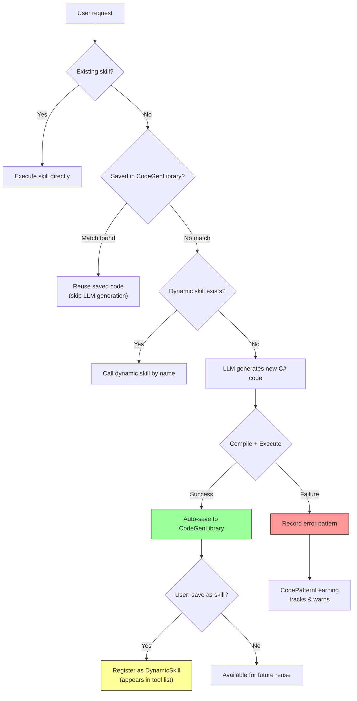

### Three Modules

| Module | File | Purpose |
|---|---|---|
| **CodeGenLibrary** | `codegen/codegen_library.json` | Saves successful code + description + keywords. Future similar requests reuse cached code without LLM generation. |
| **DynamicSkillRegistry** | `codegen/dynamic_skills.json` | Promotes codegen code to named skills that appear in the LLM's tool list. Called directly like built-in skills. |
| **CodePatternLearning** | `codegen/patterns.json` | Tracks API usage frequency, error patterns, and learned fixes. Injects warnings and optimizations into LLM context. |

### How It Works

1. **First time**: User asks "count ducts by level" → LLM generates code → executes → result saved to library
2. **Second time**: Same request → library match found → code reused instantly (no LLM call)
3. **Promotion**: User says "save this as a skill" → `save_as_skill="count_ducts_by_level"` → skill registered
4. **Third time**: LLM sees `count_ducts_by_level` in tool list → calls it directly
5. **Error learning**: If codegen fails with pattern X → pattern recorded → LLM warned to avoid it next time

### Storage Structure

```
codegen/
├── codegen_library.json      # Cached successful code (up to 200 entries, LRU)
├── dynamic_skills.json       # User-promoted skills (persist across restarts)
└── patterns.json             # Error patterns, API usage stats, learned fixes
```

## Memory System (Cross-Session Learning)

The chatbot includes a comprehensive memory system that persists across sessions:

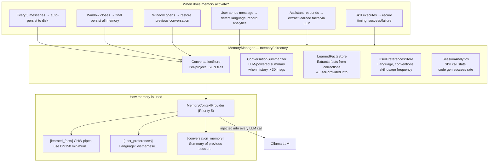

### Memory Files Structure

```
memory/
├── conversations/
│   ├── conv_my_project_name.json      # Per-project conversation snapshot
│   └── conv_another_project.json
├── learned_facts.json                  # Facts extracted from user corrections
├── preferences.json                    # User preferences (language, conventions)
└── analytics.json                      # Skill usage stats, code gen metrics
```

### Self-Learning Flow

1. **User corrects the bot**: "Không phải vậy, ống CHW trong dự án này dùng DN150 tối thiểu"
2. **LearnedFactsStore** detects correction markers ("không phải", "thực ra", etc.)
3. **LLM extracts facts**: `["CHW pipes in this project use DN150 minimum"]`
4. **Fact is persisted** to `learned_facts.json`
5. **Next session**: fact is injected into `[learned_facts]` context, LLM remembers

## Query Understanding & Adaptive Prompting

The chatbot preprocesses every user query through a multi-stage pipeline for accurate intent resolution:

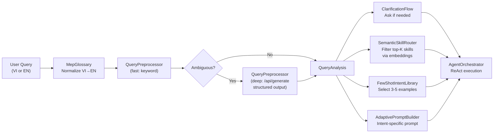

### Stage 1: Smart NLU (6 Modules)

| Module | File | Purpose |
|---|---|---|
| **MepGlossary** | `LLM/MepGlossary.cs` | 120+ bilingual (VI↔EN) MEP term mappings. Normalizes "ống gió" → "duct", "va chạm" → "clash". Also detects intent, category, system type, level, and element IDs from text. |
| **QueryPreprocessor** | `LLM/QueryPreprocessor.cs` | Two-tier analysis: fast (keyword-based, ~0ms) and deep (Ollama `/api/generate` with structured JSON output, ~200ms). Deep analysis only triggers for ambiguous queries. |
| **FewShotIntentLibrary** | `LLM/FewShotIntentLibrary.cs` | 40+ curated few-shot examples mapping user queries to expected skill calls. Ranked by intent+category match and injected into context (3-5 examples per query). |
| **AdaptivePromptBuilder** | `LLM/AdaptivePromptBuilder.cs` | Constructs intent-specific system prompts. Query mode gets query guidance; Check mode gets QA/QC workflow; Modify mode gets confirmation rules; Calculate mode gets formulas. Reduces prompt size by ~40%. |
| **SemanticSkillRouter** | `LLM/SemanticSkillRouter.cs` | Pre-computes embeddings for all skill descriptions. Routes queries to top-K most relevant skills (cosine similarity), falling back to keyword matching. Reduces tool list from 25+ to ~10 per call. |
| **ClarificationFlow** | `LLM/ClarificationFlow.cs` | Detects when user query is too vague and generates bilingual clarification questions with options (e.g., "Which MEP element type?" with choices). Enriches query with user's response. |

### Stage 2: Advanced LLM Intelligence (10 Modules)

| Priority | Module | File | Purpose |
|---|---|---|---|
| **P0** | **ConversationQueryRewriter** | `LLM/ConversationQueryRewriter.cs` | Rewrites short/contextual queries using recent conversation. E.g., "còn ống nước?" → "đếm ống nước tầng 2". Uses `/api/generate` structured output. |
| **P0** | **ContextWindowOptimizer** | `LLM/ContextWindowOptimizer.cs` | Token budget management (chars/4 heuristic). Trims system prompt by intent, prioritizes context entries, and truncates history to fit within `NumCtx=8192`. |
| **P1** | **SmartHistoryPruner** | `LLM/SmartHistoryPruner.cs` | Keeps recent 6 messages full, summarizes older ones, removes noise (cancelled actions, empty thinking). Auto-triggers at 16+ messages. |
| **P1** | **MultiIntentDecomposer** | `LLM/MultiIntentDecomposer.cs` | Splits compound queries ("kiểm tra vận tốc gió và va chạm tầng 3") into independent sub-queries with separate intents. Fast keyword split + deep LLM fallback. |
| **P1** | **AdaptiveFewShotLearning** | `LLM/AdaptiveFewShotLearning.cs` | Learns from successful skill invocations and persists as few-shot examples. Prioritized over static FewShotIntentLibrary. Cross-session persistence. |
| **P2** | **DynamicGlossary** | `LLM/DynamicGlossary.cs` | Per-project terminology learning. Registers Family/Type names from model inventory. Learns corrections ("không phải, ý tôi là..."). Extends MepGlossary at runtime. |
| **P2** | **SkillSuccessFeedback** | `LLM/SkillSuccessFeedback.cs` | Boosts skill routing scores based on SessionAnalytics. Skills with >80% success rate and 3+ calls get higher priority. Penalizes failing skills. |
| **P2** | **PromptCache** | `LLM/PromptCache.cs` | Pre-compiles static prompt content (CheatSheet, ErrorFixes, CodeExamples) on startup. Serves cached content by intent to avoid rebuilding ~9000 tokens per call. |
| **P2** | **ResponseQualityValidator** | `LLM/ResponseQualityValidator.cs` | Validates responses: checks data references, language match, markdown formatting, specificity. Triggers auto-retry with feedback for low-quality responses (score < 4/10). |
| **P3** | **StreamingIntentDetector** | `LLM/StreamingIntentDetector.cs` | Pure keyword-based early intent detection on partial input while user types. Predicts intent/category with confidence score. No LLM call. |

### Ollama API Optimizations

| Setting | Before | After | Impact |
|---|---|---|---|
| `Temperature` | 0.7 | 0.3 | More deterministic, better tool selection |
| `NumCtx` | 4096 | 8192 | Fits longer context (model inventory + few-shot + codegen history) |
| `KeepAlive` | 5m | 10m | Model stays loaded longer between queries |
| `/api/generate` | Not used | Used for structured intent extraction | JSON schema output for precise entity extraction |

### Query Processing Pipeline (Full)

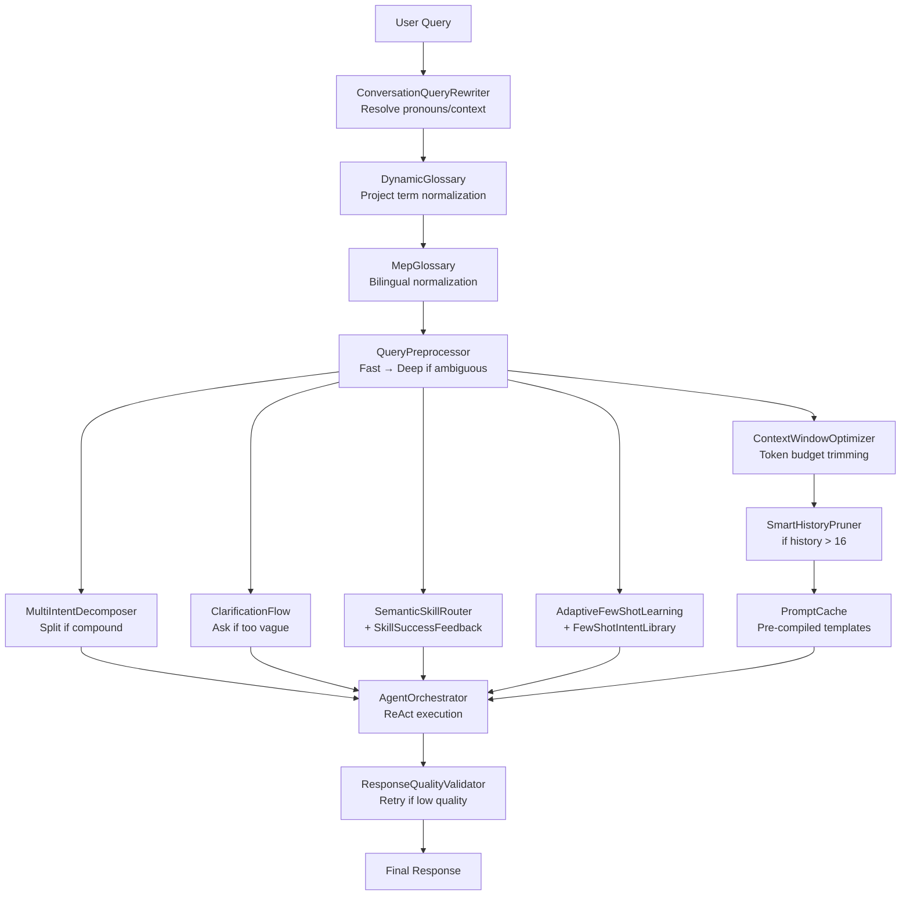

#### Example Walkthrough

1. **User types**: "kiểm tra bảo ôn ống lạnh tầng 2"
2. **ConversationQueryRewriter**: No rewriting needed (query is self-contained)
3. **DynamicGlossary**: Checks project-specific terms (none matched)
4. **MepGlossary**: Normalizes → "check insulation chilled_water_pipe Level 2"
5. **QueryPreprocessor (fast)**: `{intent: "check", category: "pipe", systemType: "ChilledWater", level: "Level 2"}`
6. **AdaptiveFewShotLearning**: Returns 2 learned examples from past sessions
7. **FewShotIntentLibrary**: Selects 3 static examples → total 5 examples
8. **SemanticSkillRouter + SkillSuccessFeedback**: Ranks skills, boosts `check_insulation` (90% success rate)
9. **ContextWindowOptimizer**: Trims system prompt to "Check Mode" sections only, prioritizes model_inventory
10. **SmartHistoryPruner**: History < 16, no pruning needed
11. **PromptCache**: Returns pre-compiled CheatSheet
12. **AgentOrchestrator**: LLM calls `check_insulation` with correct params
13. **ResponseQualityValidator**: Score 8/10, passes (response references element IDs and uses table)

## Self-Training System (Autonomous Improvement)

The chatbot continuously improves through a multi-layered self-training pipeline that runs both inline (after each interaction) and in the background (every 30 minutes):

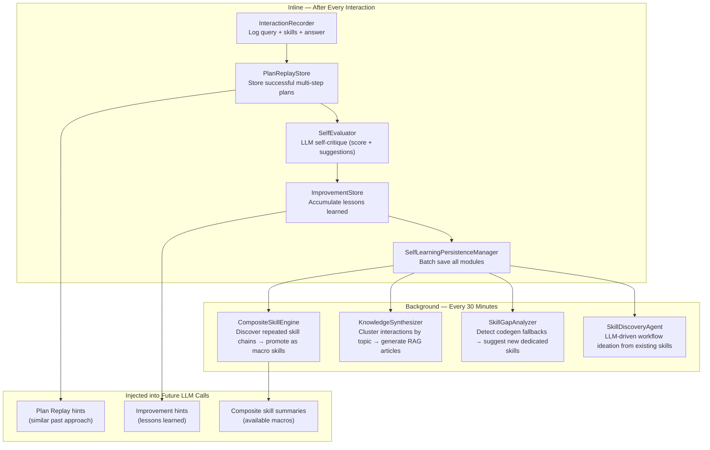

### Self-Training Modules

| Module | Trigger | Purpose |
|---|---|---|
| **PlanReplayStore** | After each multi-step plan | Stores successful plans with semantic embeddings. Injects similar past plans as hints for new queries. |
| **InteractionRecorder** | After each interaction | Logs query, skills used, answer, and topic. Feeds knowledge synthesis and gap analysis. |
| **SelfEvaluator** | After plans with 2+ actions | LLM evaluates its own plan (completeness, efficiency, accuracy). Generates improvement suggestions. |
| **ImprovementStore** | From SelfEvaluator | Accumulates "lessons learned" across sessions. Injected into future prompts to guide decisions. |
| **CompositeSkillEngine** | Background (30min) | Discovers recurring skill chains (e.g., query→check→report) and promotes them as single callable skills. |
| **KnowledgeSynthesizer** | Background (30min) | Clusters recent interactions by topic, uses LLM to generate knowledge articles, indexes them in RAG. |
| **SkillGapAnalyzer** | Background (weekly) | Detects queries that always fall back to codegen, suggests dedicated skill definitions. |
| **SkillDiscoveryAgent** | Background (3-day) | LLM analyzes existing skills and patterns to propose novel workflow combinations. |
| **SelfLearningPersistenceManager** | After N changes | Coordinates saving all learning data across modules. Batches writes to minimize I/O. |
| **SelfTrainingScheduler** | Continuous (30min timer) | Orchestrates all background self-training tasks during idle time. |

### Self-Training Data Flow

```
User interaction
  → InteractionRecorder logs it
  → PlanReplayStore saves the plan (if multi-step)
  → SelfEvaluator critiques the plan (if 2+ actions)
    → ImprovementStore records suggestions
    → CompositeSkillEngine considers promotion
  → SelfLearningPersistenceManager batches save

Background cycle (every 30 min):
  → CompositeSkillEngine discovers skill chains → promotes new composite skills
  → KnowledgeSynthesizer generates articles → indexes in RAG vector store
  → SkillGapAnalyzer identifies missing skills (weekly)
  → SkillDiscoveryAgent proposes new workflows (every 3 days)

Next user interaction benefits from:
  → Plan replay hints ("last time you did X→Y→Z for a similar question")
  → Improvement hints ("remember to check insulation after querying pipes")
  → New composite skills (callable as single tools)
  → New knowledge articles (found via RAG search)
```

## References

- [Revit API 2025.3 Docs](https://www.revitapidocs.com/2025.3/)
- [Ollama GitHub + API Docs](https://github.com/ollama/ollama)
- [Ollama REST API - /api/generate](https://docs.ollama.com/api/generate) — structured output, thinking mode
- [WebView2 Documentation](https://learn.microsoft.com/en-us/microsoft-edge/webview2/)
